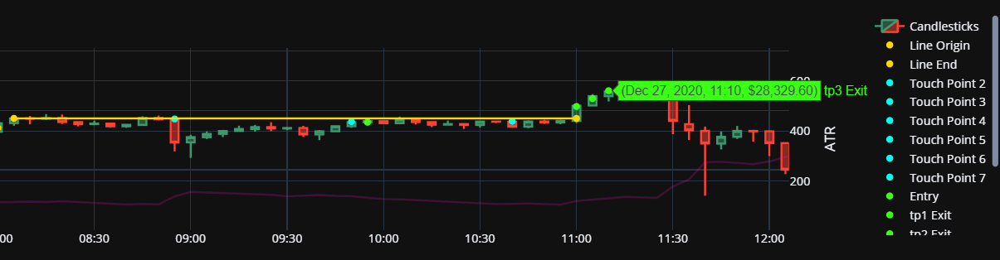
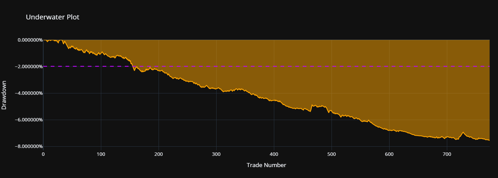
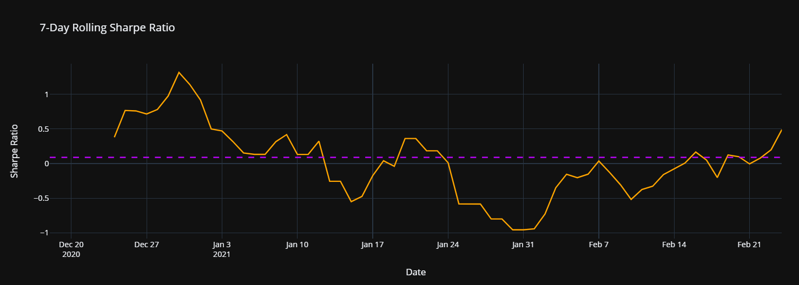
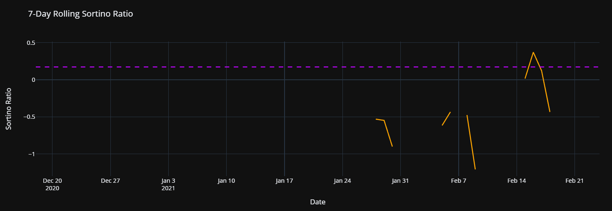
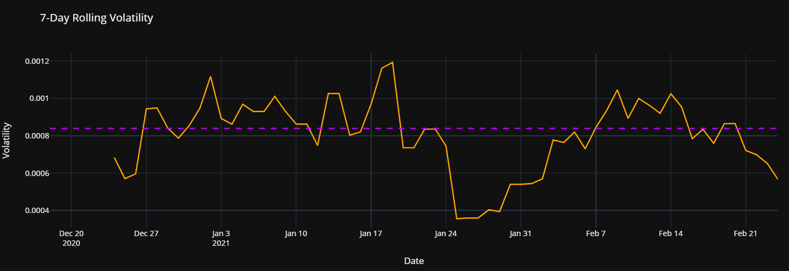
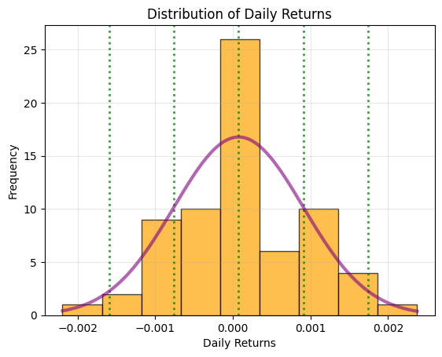

## **Overview** ##

0. DownloadData.ipynb to download bulk OHLC data from binance if needed.
1. Global Variables, OHLC Data, Calculate 'Simple/Objective' Indicators
2. Define & Calculate 'Complex/Subjective' Indicators (Ex: Horizontal Lines)
3. Define Trading Strategy
4. Analyzes Trading Results
    1. Candlestick Chart with Trades
    2. Trade Stats Calculations
    3. Cumulative Portfolio Value Graph, Underwater Plot, Rolling Risk Metrics
    4. Distribution of Daily Returns, Distribution of Randomly Sampled Trades
    5. Returns from Entry

 

## **Pictures** ##

 
 
You can zoom in on the graph in the code to check and make sure entries are correct. Plotly graphs don't show up in the code viewer in github.
 
 

 
 

 
 

 
 

 
 

 
 

 
 

 
 

 
 

 
 

