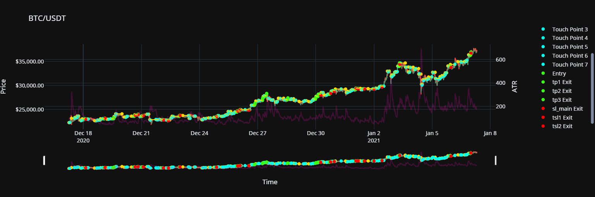
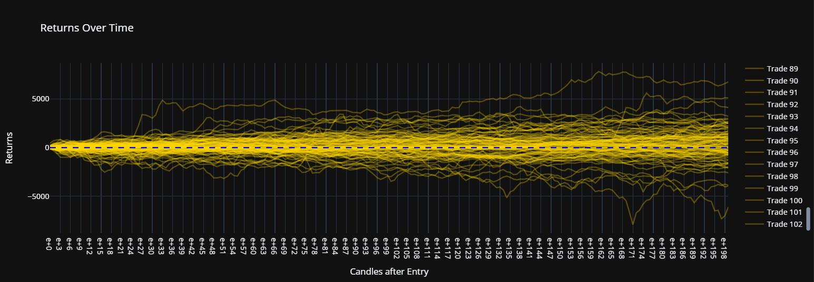
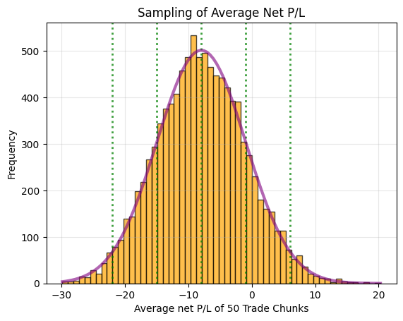
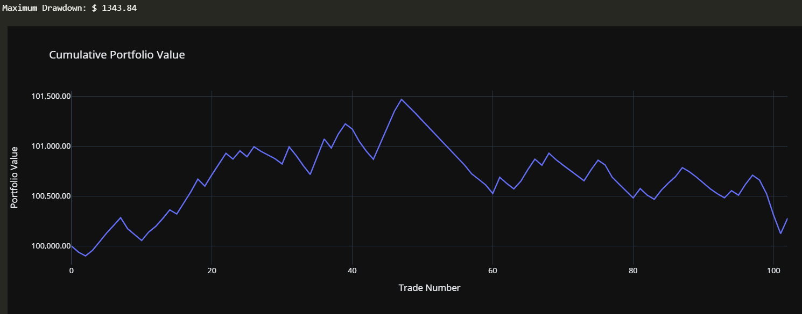

                                                    **HORIZONTAL RESISTANCE LINES**

**Brief Overview:**
0. Use DownloadData.ipynb to download bulk OHLC data from binance if needed.
1. Load in csv and make OHLC+indicators df (btc_usdt_df for example).
2. Finds Horizontal resistance lines 
3. Defines a trading strategy
4. Calculates trading results
5. Analyzes trading results
 
 
**Ideas:**
 
 
- Horizontal Support Lines (Very similar to Horiontal Resistance Lines).
 
- Horizontal Channels: Horizontal support+resistance lines using this code.
 
- Slanted Channels: non-zero slope support+resistance lines would create channels. Probs use horizontal line ideas and least squares combined.
 
- ML could/will be used to optimize Entry/SL/TP/trailing SL levels, based on the features (indicators) and target ('returns' or 'net_pl_with_fee').
 
- 'simple/objective indicators' like RSI/MACD/ATR/EMA/SMA/etc. 100% based on price & time with simple formula. Calculable in single line of code, everyone agrees that it is indeed the only and correct way to do it.
 
- 'complex/subjective indicators' like [(resistance lines, support lines, channels) --> (with 0 or non-0 slopes)], price zones, RSI divs, Fib retracements. Requires sophisticated function to define and find the price and time points where they occur. Requires tweaking until they match close enough with reality of what a trader would see or draw.
 
 
**Pictures:**
 
 

 
 

 
 

 
 

